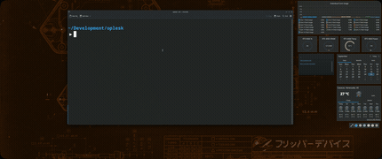
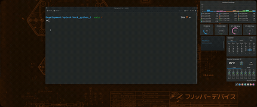
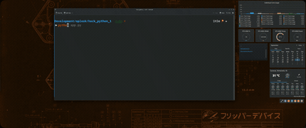

# SOCIAL OPLESK

### HACKS PYTHON 1

10 hacks para practicar Python: tipos de datos, operadores, condicionales y
bucles. Cada hack es un script con errores o incompleto que debes corregir. Un
test valida automáticamente tu solución.

---

## Cómo empezar

### 1) Clonar el repositorio

```bash
git clone https://github.com/metalpoch/hack_python_1
cd hack_python_1
```

<details>
<summary>📺 Ver demostración</summary>



</details>


### 2) Prepara el entorno

#### Opción A — con uv (recomendado)
Si tienes [`uv`](https://docs.astral.sh/uv/) instalado puedes usar:

```bash
uv sync
```
`uv` crea el entorno virtual e instala las dependencias exactas del proyecto
en un solo paso.
<details>
<summary>📺 Ver demostración</summary>



</details>

#### Opción B — con pip (flujo tradicional)
```bash
python -m venv .venv
source .venv/bin/activate        # Linux / macOS
# .venv\Scripts\activate         # Windows
pip install -r requirements.txt
```
Con esta opción debes activar el entorno cada vez que abras una terminal nueva.
<details>
<summary>📺 Ver demostración</summary>



</details>


### 3) Ejecutar los tests
Si usaste uv:
```bash
# Todos los hacks
uv run pytest test_hack.py -v

# Un hack específico
uv run pytest test_hack.py::test_hack_1 -v
```

Si usaste pip (con el venv activado):
```bash
# Todos los hacks
pytest test_hack.py -v

# Un hack específico
pytest test_hack.py::test_hack_1 -v
```

> Si no reconoce el comando `pytest`, usa: `python -m pytest test_hack.py -v`

---

## Hacks

| Hack | Tema |
| ---- | ---- |
| H-1  | Tipos de datos |
| H-2  | Texto (str) |
| H-3  | Operadores aritméticos |
| H-4  | Operadores de comparación y lógicos |
| H-5  | Condicionales (`if` / `elif` / `else`) |
| H-6  | Condicionales anidados |
| H-7  | Bucle `for` |
| H-8  | Bucle `while` |
| H-9  | `break` y `continue` |
| H-10 | Integrador |

---

## Ejemplo

Cada hack trae funciones incompletas. Por ejemplo:

```python
"""
input: ("10", 3.14, 42, "True")
output => (10, 3.14, "42", True)
"""


def fn_hack_1():
    result = ("10", 3.14, 42, "True")
    #...
    return result

```

La función inicia con la tupla **input** `("10", 3.14, 42, "True")` y debe finalizar con la tupla **output** `(10, 3.14, "42", True)`.

**Paso 1.** Abre el archivo del hack (`hack_1.py`, `hack_2.py`, ...) y resuelve la función inyectando codigo donde se encuentra `#...`:

```python
def fn_hack_1():
    result = ("10", 3.14, 42, "True")

    result = (int(result[0]), result[1], str(result[2]), bool(result[3]))

    return result
```
_hay infinidad de formas de resolver cada hack, lo importante es llegar al resultado correcto._

**Paso 2.** Ejecuta el test del hack que estés resolviendo (cambia el número):

Con `uv`:
```bash
uv run pytest test_hack.py::test_hack_1 -v
```

Con `pip` (venv activado):
```bash
pytest test_hack.py::test_hack_1 -v
```


**Paso 3.** Repite hasta que todos los tests pasen.

